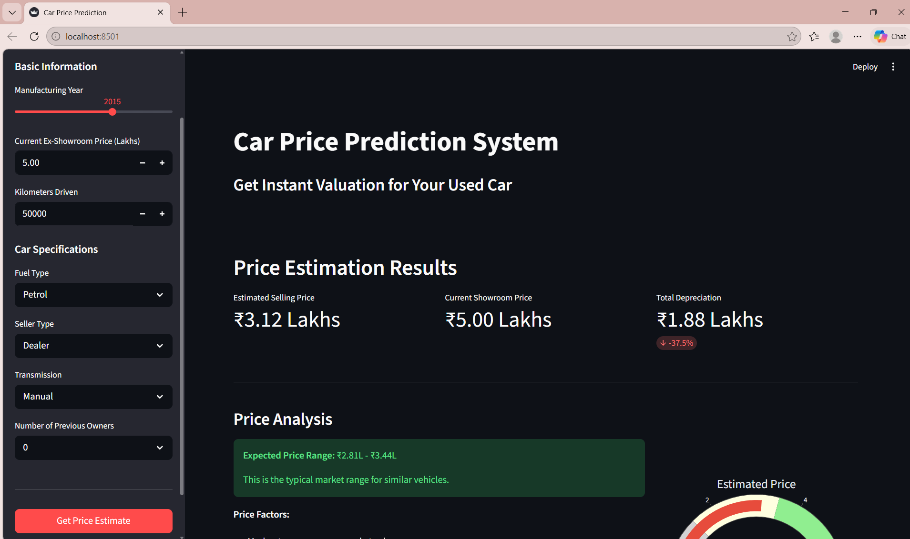

# 🚗 Car Price Prediction ML Model

A Machine Learning project that predicts the price of a car based on various features such as brand, year, fuel type, and more.

---

## 📌 Project Overview

This project uses a trained machine learning model to estimate car prices. It includes:

* Data preprocessing
* Model training
* Model serialization
* A simple user interface for prediction

---

## 📂 Project Structure

```
car-price-prediction-ML-model/
│
├── car-app.py                  # Application script (UI / API)
├── car-price-prediction.ipynb # Jupyter Notebook (training & analysis)
├── car_data.csv               # Dataset
├── car_prediction_model.pkl   # Trained ML model
├── requirements.txt           # Dependencies
├── User_interface.png         # UI preview
└── README.md                  # Project documentation
```

---

## ⚙️ Features

* Predicts car prices based on input features
* Trained using regression algorithms
* Easy-to-use interface
* Ready-to-deploy model (.pkl file)

---

## 🧠 Machine Learning Workflow

1. Data Collection
2. Data Cleaning & Preprocessing
3. Feature Engineering
4. Model Training
5. Model Evaluation
6. Model Saving using Pickle

---

## 🚀 Getting Started

### 1. Clone the Repository

```bash
git clone https://github.com/your-username/car-price-prediction-ML-model.git
cd car-price-prediction-ML-model
```

### 2. Install Dependencies

```bash
pip install -r requirements.txt
```

### 3. Run the Application

```bash
python car-app.py
```

---

## 📊 Dataset

The dataset (`car_data.csv`) contains information such as:

* Car Name / Brand
* Year of Manufacture
* Present Price
* Kilometers Driven
* Fuel Type
* Seller Type
* Transmission
* Owner

---

## 📈 Model Details

* Algorithm Used: (e.g., Linear Regression / Random Forest — update this)
* Evaluation Metrics: R² Score, MAE, RMSE

---

## 🖥️ User Interface

Below is a preview of the application interface:



---

## 🛠️ Tech Stack

* Python
* Pandas
* NumPy
* Scikit-learn
* Matplotlib / Seaborn (for visualization)

---

## 📦 Requirements

All dependencies are listed in `requirements.txt`.

---

## ✨ Future Improvements

* Deploy using Flask/Django
* Add more advanced models
* Improve UI/UX
* Integrate real-time data

---

## 🤝 Contributing

Contributions are welcome! Feel free to fork the repo and submit a pull request.

---

## 📜 License

This project is open-source and available under the MIT License.

---

## 👨‍💻 Author

**Saurabh**

---

⭐ If you like this project, don't forget to star the repository!
